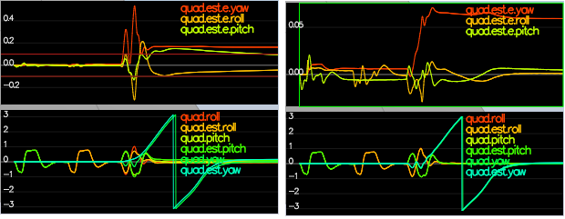
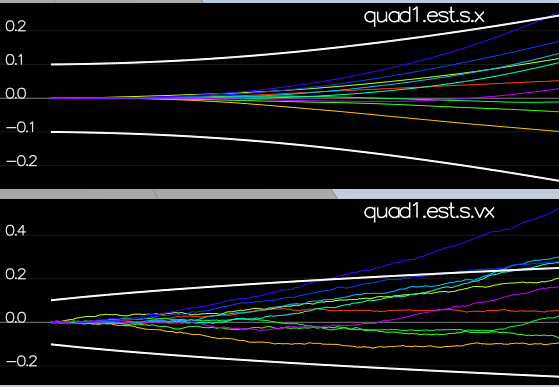

# Estimation Project #

Welcome to the estimation project.  In this project, a simulated quad will be flying with our developed estimator and custom controller.

## Implement Estimator ##

The estimator is built up in pieces.  At each step, there will be a set of success criteria that will be displayed both in the plots and in the terminal output.

### Determine the standard deviation of the measurement noise of both GPS X data and Accelerometer X data. ###

A quick python program was written to read the csv files `config/log/Graph1.txt` (GPS X data) and `config/log/Graph2.txt` (Accelerometer X data) using the built-in function `np.loadtxt`. A while loop was implemented to ensure that there were at least 99 GPS data points in a stored array before using the built-in `np.std` to calculate the standard deviation. I experimented with Scenario 6 to determine 99 GPS points and the corresponding number of IMU points are the maximum provided before the scenario restarts. Calculated values for `MeasuredStdDev_GPSPosXY` and `MeasuredStdDev_AccelXY` are `0.71` and `0.49`, respectively. 

### Implement a better rate gyro attitude integration scheme in the `UpdateFromIMU()` function. ###

In Section 7.1.2 of [Estimation for Quadrotors](https://www.overleaf.com/read/vymfngphcccj) a non-linear complimentary filter for attitude using quarternions is described. It is implemented in `Lines 96-101` of `QuadEstimatorEKF.cpp` in the function `UpdateFromIMU()`. The `Quaternion<float>::FromEuler123_RPY(rollEst, pitchEst, ekfState(6))` function is used on `Line 96` to create the quarternion of the current estimated state and the following line (`q_t.IntegrateBodyRate(gyro, dtIMU)`) implements the integration using the body rate measurements from the gyro. This implementation reduced attitude errors to get within 0.1 rad for each of the Euler angles, as shown in the screenshot below.

In the screenshot above the attitude estimation using linear scheme (left) and using the improved nonlinear scheme (right). Note that Y axis on error is much greater on left.

### Implement all of the elements of the prediction step for the estimator. ###

In `QuadEstimatorEKF.cpp`, the state prediction step in the `PredictState()` functon is implemented in `Lines 163-169`. An attitude quarternion that was created for us using the current vehicle estimated attitude is used to rotate the accelerometer measurements from body frame to inertial frame (`attitude.Rotate_BtoI(accel)`). At this point the first 6 variables of the predicted state vector are updated and gravity was accounted for when updating the vertical velocity. Scenario `08_PredictState` will then show the estimator state track the actual state, with only reasonably slow drift, as shown in the figure below:

In `QuadEstimatorEKF.cpp`, calculation for the partial derivative of the body-to-global rotation matrix in the function `GetRbgPrime()` is implemented in `Lines 195-197`. The partial derivatives were written as described in section 7.2 of [Estimation for Quadrotors](https://www.overleaf.com/read/vymfngphcccj). The state covariance is predicted forward in `Predict()` which is implemented in `Lines 243-255` in accordance with the classic EKF prediction equations. Scenario `09_PredictionCov` is then ran with `QPosXYStd = 0.1` and `QVelXYStd = 0.18` process parameters in `QuadEstimatorEKF.txt` to capture the magnitude of the error. The solution looks as follows:

Looking at this result, you can see that in the first part of the plot, our covariance (the white line) grows very much like the data.

### Implement the magnetometer update. ###

Scenario `10_MagUpdate` is completed by implementing magnetometer update in the function `UpdateFromMag()`, which is located  on `Lines 309-311` of `QuadEstimatorEKF.cpp`. The diffenrece between the measured and estimated yaw is normalized on `Line 310` (`AngleNormF(z(0) - zFromX(0))`) in order to force the quad to always take the short path around the circle.  Lastly,`QYawStd = 0.12` (`QuadEstimatorEKF.txt`) is tuned to balance between the long term drift and short-term noise from the magnetometer. The result is an estimated standard deviation that accurately captures the error and a heading error of less than `0.1 rad` for at least 10 seconds as shown below:

### Implement the GPS update. ###

Scenario `11_GPSUpdate` was satisfied by the implementation of the EKF GPS Update in the function `UpdateFromGPS()` located on `Lines 279-288` of `QuadEstimatorEKF.cpp`. The update allowed the scenario to complete the entire simulation cycle with estimated position error of < 1m.

### Adding Previous Controller ###

`QuadController.cpp` and `QuadControlParams.txt` were replaced with the ones developed in the controller project. Running scenario `11_GPSUpdate` initially produced some very erratic behavior (a lot of uneccesary pitch and roll oscillations and sometimes a crash). The position and velocity gains were decreased by about 30% to stabilize it. The quad once again was  able to complete the entire simulation cycle with an estimated position error of < 1m. At this point I experimented further with the `z PID` gains in order to prevent the quad from making extreme changes in altitude. I spent some time making it as graceful and as smooth as possible while satisfying the original criteria. I have gain a real appreciation for just how hard  it is to make something fly gracefully.
